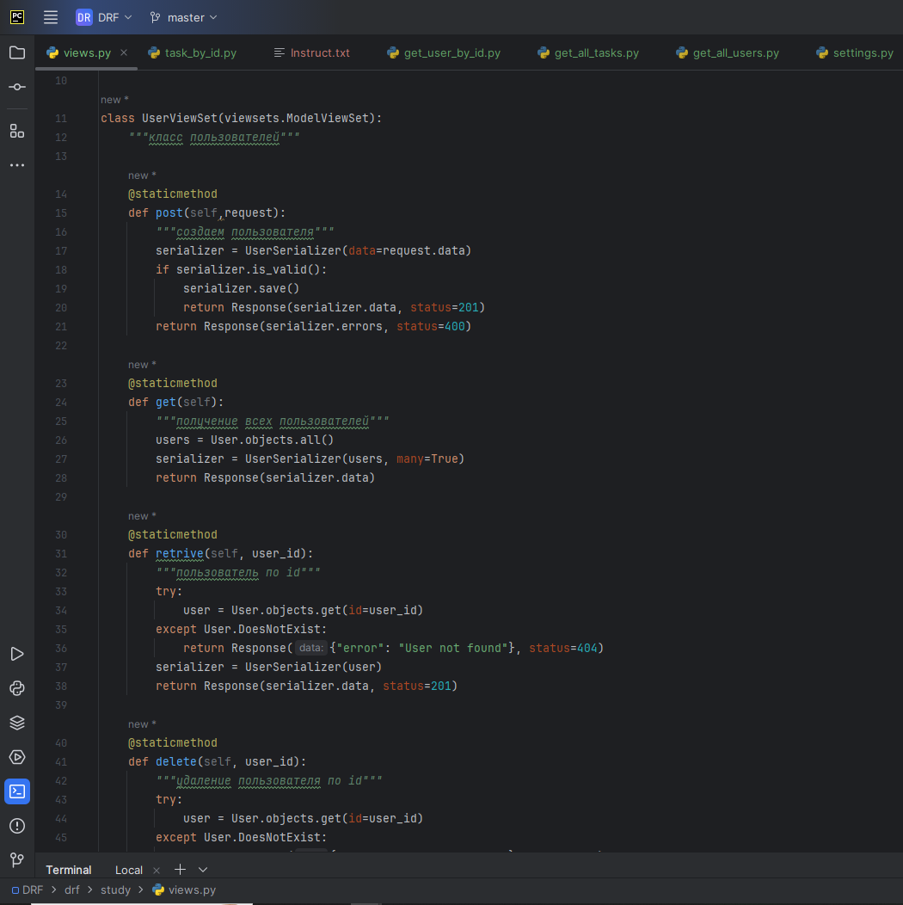

 # Дипломная работа

## Тема:  Сравнение различных подходов к реализации REST API: Django Rest Framework, FastAPI и Flask-RESTful: Разработать REST API с использованием Django Rest Framework, FastAPI и Flask-RESTful, провести их сравнение.

**Автор: Касымов Дмитрий Владимирович**

## Оглавление :
1.	Введение
2.	Основные понятия и определения
3.	Методы и подходы к разработке
4.	Архитектура приложения
5.	Проектирование приложения
6.	Разработка в соответствии с созданной документацией
7.	Сравнение фреймворков Django Rest Framework, FastAP, Flask-RESTful

## 1.Введение
### Обоснование выбора темы:
1.	В современном мире любой сервис, который хочет масштабироваться и захватить “новую” целевую аудиторию, например в виде разработчиков ПО и крупных компаний, которые не готовы мириться с базовым функционалом клиентской части приложения, а стремятся автоматизировать работу интегрируя в свою экосистему все больше и больше возможностей требуют разработки своего REST API.
2.	Потребности рынка: веб-разработчики, а также разработчики REST API пользуются растущим спросом т.к. почти любая крупная компания разрабатывает API своего сервиса, будь то открытое или закрытое, потому что: нет в интернете - нет в бизнесе.
3.	Практическая значимость: Работа над API позволит серьезно прокачать навыки веб-разработки “с другой стороны” не загружая себя изучением дополнительных языков по типу: HTML, CSS, JS и их специфических фреймворков.
4.	Личный интерес и потенциальные перспективы: лично мне очень интересно поработать по обе стороны разработки веб-приложений. Кроме того, такие навыки востребованы на рынке труда, что открывает перспективы для карьерного роста и развития.
Таким образом, выбор проекта REST API  обусловлен ее актуальностью, потребностями рынка, практической значимостью и личным интересом, что делает эту тему подходящей для проведения дипломной работы

### Определение цели и задач исследования:
Цель исследования: написать REST API для связи пользователь- поставленные задачи, а также сравнить фреймворки для его написания
#### Задачи исследования:
1.	Обзор фреймворков для разработки REST API
2.	Разработка сценариев сравнения: определить критерии сравнения и сформировать набор данных для первичной проверки.
3.	Создание платформы и проведение тестирования: реализовать REST API сервиса для пары пользователь-поставленные задачи в разных вариациях технологий, и провести их тестирование.
4.	Написание дипломной работы: составить дипломную работу, включающую в себя введение, обзор литературы, методологию и результаты исследования, анализ результатов, выводы и рекомендации.
Цели и задачи исследования направлены на получение практических результатов, которые позволят сформировать рейтинг технологий для написания REST API.
##  2. Основные понятия и определения
Обзор основных понятий в сервисе REST API для связи пользоваетль-задачи:
1.	Фреймворк (Framework): Программная платформа, которая предоставляет готовые компоненты и инструменты для разработки приложений. В контексте REST API часто используются Django Rest Framework, FastAPI и Flask-RESTful.
2.	REST (Representational State Transfer) API — это архитектурный стиль для построения веб-сервисов, основанный на использовании HTTP-протокола для обмена данными между клиентом и сервером.
3.	Веб-приложение (Web Application): Программное приложение, которое работает на веб-сервере и доступно через браузер.
4.	СУБД (Система Управления Базами Данных) — это программное обеспечение, предназначенное для создания, управления и хранения баз данных.
5.	Данные — это любая информация, представленная в формализованном виде, пригодная для хранения, передачи, обработки и интерпретации человеком или автоматизированной системой. В контексте нашего проекта данные представляют собой информацию о товарах маркетплейса
  ##  3. Методы и подходы к разработке
 Архитектура веб-приложения
1.	 Django REST Framework:
* Использование моделей Django для представления сущностей (User, Task.)
* Реализация ViewSets и Serializers для обработки HTTP-запросов и представления данных
* Настройка маршрутизации с помощью DefaultRouter
* Использование Django ORM для работы с базой данных

2.	FastAPI:
* Определение Pydantic-моделей для представления сущностей
* Реализация CRUD-операций с использованием FastAPI-маршрутов
* Интеграция с СУБД c использованием SQLAlchemy
* Применение Pydantic для построения и валидации запросов/ответов
3.	Flask-RESTful:
* Определение ресурсов (Resource) для обработки HTTP-методов
* Использование Flask-RESTful для маршрутизации и сериализации
* Интеграция с СУБД с применением SQLAlchemy
* Применение Marshmallow для сериализации и валидации данных
 ## 4. Архитектура приложения:
1.	Модели:
* User: firstname, lasrname, email, job, age
* Task: title, content,  priority, completed, user_id, slug
2.	Эндпоинты:
* POST /user/: регистрация нового пользователя
* POST /task/: создание новой задачи
* DELETE /user/{user_id}/:удаление пользователя по id
* DELETE /task/{task_id}/:удаление задачи по id
* PATCH /products/{task_id}/: частичное изменение данных задачи
* GET/user/: получение списка пользователей
* GET/task/: получение списка задач
* GET/task/{task_id}: получение задачи по id
* GET/user/{user_id}: получение пользователя по id
3.	Базовая структура:
* Уровень моделей (модели Django, Pydantic или SQLAlchemy)
* Уровень сервисов (бизнес-логика)
* Уровень контроллеров/представлений (обработка HTTP-запросов)
* Уровень маршрутизации (определение URL-адресов и HTTP-методов)
* Уровень взаимодействия с базой данных (Django ORM, SQLAlchemy)

Реализация данного приложения в трех вариантах (Django REST Framework, FastAPI и Flask-RESTful) позволит нам провести сравнительный анализ и выявить сильные и слабые стороны каждого подхода.
### Особенности:
1.	Django REST Framework:
* Django REST Framework (DRF) — это мощный и гибкий набор инструментов для построения веб-API на основе Django.
* Основные преимущества DRF:
  * Предоставляет готовые решения для CRUD-операций, сериализации, аутентификации и авторизации.
  * Поддержка различных форматов данных (JSON, XML, etc.).
  * Встроенная документация API (Browsable API и Swagger).
  * Расширяемость за счет большого сообщества разработчиков.
  * Интеграция с Django ORM для работы с базой данных.
* Недостатки:
  * Относительно высокая сложность настройки и конфигурирования.
  * Может быть избыточным для простых API-приложений.
2.	FastAPI:
* FastAPI - современный, быстрый (с высокой производительностью) веб-фреймворк для построения API с использованием Python 3.6+.
* Основные преимущества FastAPI:
  * Высокая производительность, основанная на ASGI-серверах (Starlette и Uvicorn).
  * Простота и быстрота разработки благодаря использованию типизированных Pydantic-моделей.
  * Автоматическая генерация документации (OpenAPI/Swagger).
  * Встроенная поддержка асинхронности.
  * Гибкая система аутентификации и авторизации.
* Недостатки:
  * Относительно молодой фреймворк, меньшее сообщество и экосистема.
  * Может потребоваться больше настройки для интеграции с реляционными базами данных.
3.	Flask-RESTful:
* Flask-RESTful — это расширение к популярному Python-фреймворку Flask, предназначенное для построения RESTful API.
* Основные преимущества Flask-RESTful:
  * Простота и минималистичность, основанные на базовом Flask.
  * Гибкость и возможность кастомизации под конкретные задачи.
  * Легковесность, подходит для небольших и средних API-приложений.
  * Хорошая интеграция с сторонними библиотеками, такими как Flask-JWT-Extended для аутентификации.
* Недостатки:
  * Меньше готовых решений, чем в DRF, приходится реализовывать больше вручную.
  * Меньшая производительность по сравнению с FastAPI.
  * Может потребоваться больше времени на настройку аутентификации и авторизации.
## 5. Проектирование приложения
Планирование и анализ требований
* Выбор фреймворка и инструментов: Django Rest Framework, FastAPI, Flask-ESTful
*	Определение структуры приложения: Разработка схемы архитектуры, включающей бэкенд, базу данных и интеграцию с внешними сервисами при необходимости.
*	Разработка прототипа
*	Реализация основного функционала: Создание базовой версии приложения с минимально необходимым функционалом для тестирования и демонстрации.
*	Разработка ключевого функционала
Основные требования
Реализация REST API со следующим функционалом:
*	Загрузка данных пользователей  и задач  в СУБД
*	Получение данных о пользователях и задачах по id 
*	Изменение информации о  польхователях и задачах
*	Удаление задач, пользователей по id
Технические требования
*	Бэкенд: Python с использованием фреймворков Django Rest Framework, FastAPI, Flask-RESTful
*	База данных: Использование базы данных SQlite для хранения данных о пользователях/задачах и истории загрузок.

## 6. Разработка в соответствии с созданной документацией

Планирование разработки

### Разработка была разделена на несколько основных этапов: 
* Проектирование моделей баз данных
* Реализация серверной логики
* Разрабока функционала проверки и сериализации данных запросов
* Тестирование CRUD запросов разработанных приложений .
* Тестирование произодительности  приложений  API, разработанных на FastAPI  и Flask-REST-ful с посмощью сторонней библиотеки Benchmark.js.

##### Технологии проекта:
* Python 3.12
* Django Rest Framework
* FastAPI
* Flask-RESTful

#### Проектирование  моделей баз  данных
Созданы модели User и Task, связанные отношением между таблицами один ко многим  и функционально с помощью relationchip.

**Пример созданных баз данных  на Flask, с использованием классов, наследованнных от базового класса SQLAlchemy.Model:**

### Реализация серверной логики
Создан функционал обработки CRUD запросов на сервер.
Ниже представлен пример  функционала, разработанного на фреймворке DRF с реализаций  классового представления обработки запросов  

###  Разрабока функционала проверки и сериализации данных CRUD запросов
На фреймворках DRF, FastAPI и Flask Rest-ful разработан  функционал  проверки и сериализации даннных CRUD запросов.
Ниже представлен пример валидации данных CRUD запросов, выполненный на базе классов, наследованных  от pidantic. BaseModel. Прогарммный код написан на  FastAPI.

###  Тестирование CRUD запросов разработанных приложений .
Тестирование разработанных приложений выполнено с помощью библиотеки requests. Произведены CRUD запросы на локальный сервер компьютера, результаты представлены в виде кода ответа, времени исполнения и текста запрашиваемых даннных.
Ниже приведен примеры реализации CRUD запросов:

**получения списка пользователей:**

**получения задачи по ee id:**

**обновление данных пользователя:**

 
###  Тестирование произодительности  приложений  API, разработанных на FastAPI  и Flask-REST-ful с посмощью сторонней библиотеки Benchmark.js.
В данном функционале выполнено тестирование производительности REST API.В обоих приложениях с использованием библиотеки Benchmark.js. выполнены  POST запросы на локальный сервер – создание нового пользователя:

**{"firstname": "bom", "lastname": "kas", "email": "bom@example.com", "age": 24,"job": "programmer"}**

POST  состоял из серии 500 запросов партиями по 10  параллельных запросов.  Данный тест проведен мною 3 раза.  По результатам тестов асинхронный FastAPI, как и ожидалось показал меньшее время. 

Среднее время теста Fast API – 5,63 сек

Среднее время теста Flask – 10,52 сек

**Скриншот  теста на FastAPI:** 

**Скриншот  теста на Flask:**

  
 
###  7.Сравнение фреймворков Django Rest Framework, FastAP, Flask-RESTful
Критерии сравнения:
1.	Поддержка асинхронности - способность обрабатывать асинхронные запросы
2.	Уровень безопасности - возможности для реализации безопасности приложения
3.	Сложность настройки - уровень сложности развертывания и настройки фреймворка
4.	Скорость разработки - скорость и удобство создания API с использованием фреймворка
5.	Интеграция с базами данных - легкость работы с различными типами баз данных
6.	Скорость  обработки запросов

| Критерий                    | Fastapi                                                                                                                                       | DRF                                                                                                                                                                                                                | Flask-RESTful                                                                                                                                                                             |
|-----------------------------|-----------------------------------------------------------------------------------------------------------------------------------------------|--------------------------------------------------------------------------------------------------------------------------------------------------------------------------------------------------------------------|-------------------------------------------------------------------------------------------------------------------------------------------------------------------------------------------|
| Поддержка асинхронности     | • DRF не поддерживает асинхронную обработку запросов	• FastAPI имеет встроенную поддержку асинхронности и позволяет создавать асинхронные API | • DRF не поддерживает асинхронную обработку запросов                                                                                                                                                               | Фреймворк Flask -RESTful, как приложение WSGI, использует одну задачу/воркер для обработки одного цикла запроса/ответа                                                                    |
| Уровень безопасности        | • DRF предлагает множество встроенных инструментов для обеспечения безопасности приложения                                                    | • Fsstapi не имеет встроенной системы безопасности в традиционном понимании.  Вместо этого он предоставляет модуль fastapi.security, который включает в себя ряд классов для аутентификации и работы с API ключами | • Flask предоставляет разработчикам основу для реализации множества функций безопасности, но многие аспекты безопасности требуют ручной настройки или интеграции с внешними библиотеками. |
| Сложность настройки         | • DRF может быть сложен в настройке и требует определенных знаний Django                                                                      | • FastAPI, благодаря своей простоте и удобству использования, позволяет быстро создавать API                                                                                                                       | Flask — это легковесный веб-фреймворк для Python, который широко используется для создания веб-приложений и API.                                                                          |
| Скорость разработки         | • DRF имеет больше инструментов и функциональностей, что может замедлить скорость разработки                                                  | • FastAPI, благодаря своей простоте и удобству использования, позволяет быстро создавать API                                                                                                                       | Flask -RESTful, благодаря своей простоте и удобству использования, позволяет быстро создавать API                                                                                         |
| Интеграция с базами данных  | • DRF легко интегрируется с базами данных с использованием Django ORM                                                                         | • FastAPI также обладает хорошей интеграцией с базами данных и предоставляет возможность выбора ORM                                                                                                                | Flask поддерживает  нтеграцию с множеством различных баз данных, включая SQL и NoSQL. Выбор базы д анных зависит от нужд вашего приложения.                                      |
| Скорость обработки запросов |                                                                                                                                               | За счет поддержки асинхронности FastAPI выиграет в производительности обработки запросов у своих кокурентов.                                                                                                       |                                                                                                                                                                                           |

		
	
Исходя из этого сравнения, можно заключить, что FastAPI предлагает более высокую производительность, легкость работы с асинхронностью и безопасностью, а также удобство настройки и создания API. Flask –RESTful, также выделяется легкостью разработки, организованностью кода, а также удобством настройки и создания API.В то время как DRF может быть более удобным для разработчиков, знакомых с Django, и предоставляет больше инструментов и функциональностей для расширения приложения. Выбор между ними будет зависеть от специфики проекта и требований к зрабатываемому API.

